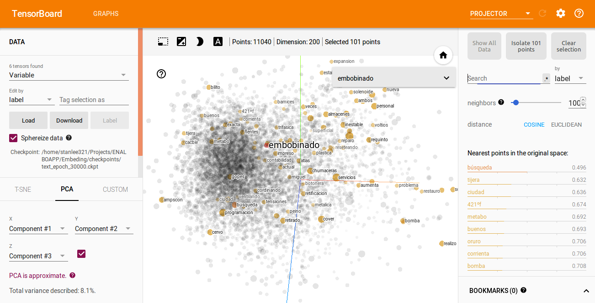
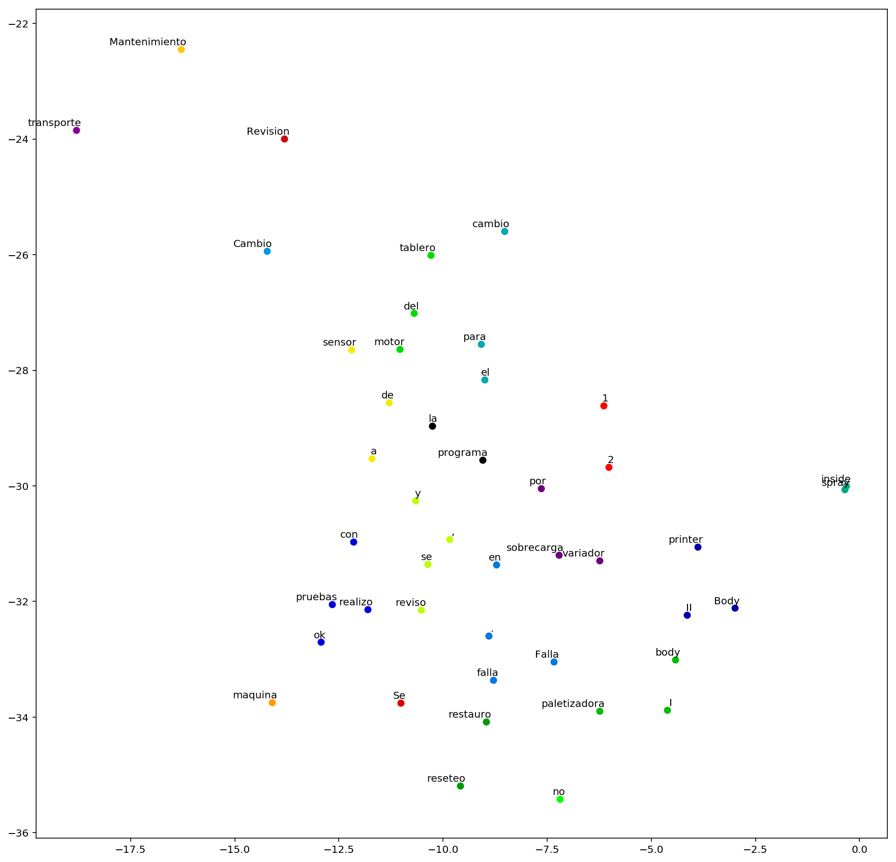

# Word Embedding for predictive maintance.

Word Embedding for predictive maintance in industry based on historic daily reports, this word embedding use the GloVe algorithm, the Visualization  of the Learnings of the GloVe Algorithm are made with TensorBoard and standar vis techniques. The information about how to run this is into the NLP.ipynb.

  
  
Example of PCA with tensorboard output of the GloVe embedding

## Introduction

The goal of this project is to create a word map that describes the influence of different aspects in an industrial installation whether motor, boards, electric machines, protection systems, etc. described in the daily reports by the workers of a factory X over the years. This is done using a GloVe word embedding in this daily reports data.

  
  
Fitting embeddings to T-SNE random sample. 

## License

This project and his data set is released under the [Apache 2.0 license](https://github.com/facebookresearch/detectron/blob/master/LICENSE). 

## Requirement
- Python 3.5
- TensorFlow >= 1.4
- NLTK

## References

- [GloVe: Global Vectors for Word Representation](https://nlp.stanford.edu/projects/glove/).
- [Natural Language Processing with TensorFlow, published by Packt
](https://github.com/PacktPublishing/Natural-Language-Processing-with-TensorFlow)
